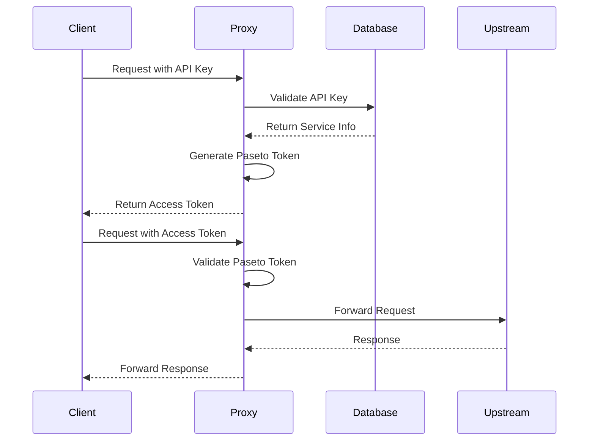

# Authentication Workflow Documentation

## Overview

The Tangle Blueprint SDK authentication system provides a three-tier token architecture designed for secure API access with different use cases:

1. **Legacy API Tokens** (being phased out): `id|token` format
2. **Long-lived API Keys**: `ak_xxxxx.yyyyy` format for authentication
3. **Short-lived Paseto Access Tokens**: `v4.local.xxxxx` format for authorization

## Token Types Explained

### API Keys (Long-lived)
- **Format**: `ak_<key_id>.<secret>`
- **Purpose**: Primary authentication credential for services
- **Lifetime**: No expiration by default (can be configured)
- **Storage**: Hashed in RocksDB
- **Use Case**: Service-to-service authentication, CI/CD pipelines

### Paseto Access Tokens (Short-lived)
- **Format**: `v4.local.<encrypted_payload>`
- **Purpose**: Temporary authorization tokens with embedded claims
- **Lifetime**: 15 minutes (configurable)
- **Storage**: Self-contained, no database storage needed
- **Use Case**: Frontend applications, temporary access grants

### Legacy API Tokens (Deprecated)
- **Format**: `id|token`
- **Purpose**: Backward compatibility
- **Status**: Being phased out, avoid for new implementations

## Authentication Flow



## TypeScript Integration Examples

### 1. Basic Setup and Types

```typescript
// types.ts
export interface ApiKey {
  key: string; // Format: "ak_xxxxx.yyyyy"
}

export interface AccessToken {
  access_token: string; // Format: "v4.local.xxxxx"
  token_type: "Bearer";
  expires_at: number; // Unix timestamp
  expires_in: number; // Seconds
}

export interface TokenExchangeRequest {
  additional_headers?: Record<string, string>;
  ttl_seconds?: number;
}

export interface ServiceCredentials {
  apiKey: string;
  serviceUrl: string;
}
```

### 2. Token Exchange Implementation

```typescript
// auth-client.ts
export class AuthClient {
  private apiKey: string;
  private baseUrl: string;
  private accessToken?: AccessToken;
  private tokenRefreshTimer?: NodeJS.Timeout;

  constructor(config: ServiceCredentials) {
    this.apiKey = config.apiKey;
    this.baseUrl = config.serviceUrl;
  }

  /**
   * Exchange API key for a short-lived access token
   */
  async exchangeToken(options?: TokenExchangeRequest): Promise<AccessToken> {
    const response = await fetch(`${this.baseUrl}/v1/auth/exchange`, {
      method: 'POST',
      headers: {
        'Authorization': `Bearer ${this.apiKey}`,
        'Content-Type': 'application/json',
      },
      body: JSON.stringify(options || {}),
    });

    if (!response.ok) {
      throw new Error(`Token exchange failed: ${response.statusText}`);
    }

    const token: AccessToken = await response.json();
    this.accessToken = token;
    
    // Setup automatic refresh before expiration
    this.scheduleTokenRefresh(token.expires_in);
    
    return token;
  }

  /**
   * Get current access token, refreshing if needed
   */
  async getAccessToken(): Promise<string> {
    if (!this.accessToken || this.isTokenExpired()) {
      await this.exchangeToken();
    }
    return this.accessToken!.access_token;
  }

  private isTokenExpired(): boolean {
    if (!this.accessToken) return true;
    const now = Math.floor(Date.now() / 1000);
    // Refresh 30 seconds before expiration
    return now >= (this.accessToken.expires_at - 30);
  }

  private scheduleTokenRefresh(expiresIn: number) {
    if (this.tokenRefreshTimer) {
      clearTimeout(this.tokenRefreshTimer);
    }
    
    // Refresh 1 minute before expiration
    const refreshIn = (expiresIn - 60) * 1000;
    if (refreshIn > 0) {
      this.tokenRefreshTimer = setTimeout(() => {
        this.exchangeToken().catch(console.error);
      }, refreshIn);
    }
  }

  /**
   * Make an authenticated request
   */
  async request<T = any>(
    path: string,
    options: RequestInit = {}
  ): Promise<T> {
    const token = await this.getAccessToken();
    
    const response = await fetch(`${this.baseUrl}${path}`, {
      ...options,
      headers: {
        ...options.headers,
        'Authorization': `Bearer ${token}`,
      },
    });

    if (!response.ok) {
      throw new Error(`Request failed: ${response.statusText}`);
    }

    return response.json();
  }

  /**
   * Cleanup timers
   */
  dispose() {
    if (this.tokenRefreshTimer) {
      clearTimeout(this.tokenRefreshTimer);
    }
  }
}
```

### 3. Multi-Tenant Support

```typescript
// multi-tenant-client.ts
export class MultiTenantAuthClient extends AuthClient {
  private tenantId?: string;

  setTenant(tenantId: string) {
    this.tenantId = tenantId;
    // Clear cached token when tenant changes
    this.accessToken = undefined;
  }

  async exchangeToken(options?: TokenExchangeRequest): Promise<AccessToken> {
    const headers: Record<string, string> = {};
    
    if (this.tenantId) {
      // Add tenant ID as a header that will be embedded in the access token
      headers['X-Tenant-ID'] = this.tenantId;
    }

    return super.exchangeToken({
      ...options,
      additional_headers: {
        ...options?.additional_headers,
        ...headers,
      },
    });
  }
}

// Usage example
const client = new MultiTenantAuthClient({
  apiKey: 'ak_2n4f8dhqp3k5.w9x7y6z5a4b3c2d1e0f9g8h7',
  serviceUrl: 'https://api.tangle.network',
});

// Set tenant context
client.setTenant('tenant-123');

// Make tenant-scoped request
const data = await client.request('/api/v1/resources');
```

### 4. React Hook Integration

```typescript
// useAuth.tsx
import { useEffect, useState, useCallback } from 'react';
import { AuthClient } from './auth-client';

interface UseAuthOptions {
  apiKey: string;
  serviceUrl: string;
}

export function useAuth({ apiKey, serviceUrl }: UseAuthOptions) {
  const [client] = useState(() => new AuthClient({ apiKey, serviceUrl }));
  const [isAuthenticated, setIsAuthenticated] = useState(false);
  const [isLoading, setIsLoading] = useState(true);
  const [error, setError] = useState<Error | null>(null);

  useEffect(() => {
    // Initial token exchange
    client.exchangeToken()
      .then(() => {
        setIsAuthenticated(true);
        setError(null);
      })
      .catch((err) => {
        setError(err);
        setIsAuthenticated(false);
      })
      .finally(() => {
        setIsLoading(false);
      });

    // Cleanup on unmount
    return () => {
      client.dispose();
    };
  }, [client]);

  const request = useCallback(async <T = any>(
    path: string,
    options?: RequestInit
  ): Promise<T> => {
    try {
      return await client.request<T>(path, options);
    } catch (err) {
      setError(err as Error);
      throw err;
    }
  }, [client]);

  return {
    isAuthenticated,
    isLoading,
    error,
    request,
  };
}

// Usage in component
function MyComponent() {
  const { isAuthenticated, isLoading, error, request } = useAuth({
    apiKey: process.env.REACT_APP_API_KEY!,
    serviceUrl: process.env.REACT_APP_SERVICE_URL!,
  });

  useEffect(() => {
    if (isAuthenticated) {
      request('/api/v1/data')
        .then(data => console.log(data))
        .catch(console.error);
    }
  }, [isAuthenticated, request]);

  if (isLoading) return <div>Authenticating...</div>;
  if (error) return <div>Auth error: {error.message}</div>;
  
  return <div>Authenticated!</div>;
}
```

### 5. Error Handling and Retry Logic

```typescript
// auth-with-retry.ts
export class ResilientAuthClient extends AuthClient {
  private maxRetries = 3;
  private retryDelay = 1000; // Start with 1 second

  async request<T = any>(
    path: string,
    options: RequestInit = {},
    retryCount = 0
  ): Promise<T> {
    try {
      return await super.request<T>(path, options);
    } catch (error: any) {
      // Check if error is auth-related
      if (error.message?.includes('401') || error.message?.includes('403')) {
        if (retryCount < this.maxRetries) {
          // Clear cached token and retry
          this.accessToken = undefined;
          
          // Exponential backoff
          const delay = this.retryDelay * Math.pow(2, retryCount);
          await new Promise(resolve => setTimeout(resolve, delay));
          
          return this.request<T>(path, options, retryCount + 1);
        }
      }
      throw error;
    }
  }
}
```

### 6. Testing Mock

```typescript
// auth-client.test.ts
export class MockAuthClient extends AuthClient {
  private mockToken = 'v4.local.mock_token_for_testing';
  
  async exchangeToken(options?: TokenExchangeRequest): Promise<AccessToken> {
    const now = Math.floor(Date.now() / 1000);
    return {
      access_token: this.mockToken,
      token_type: 'Bearer',
      expires_at: now + 900, // 15 minutes
      expires_in: 900,
    };
  }

  async request<T = any>(path: string, options: RequestInit = {}): Promise<T> {
    // Mock successful response
    return { success: true, path } as T;
  }
}
```

## Security Considerations

### Token Storage
- **Never store API keys in client-side code**
- Use environment variables or secure key management services
- Access tokens can be stored in memory or sessionStorage (not localStorage)

### Token Refresh Strategy
- Refresh tokens 1-2 minutes before expiration
- Implement exponential backoff for failed refreshes
- Clear tokens on logout or security events

### Network Security
- Always use HTTPS
- Implement certificate pinning for mobile apps
- Use request signing for additional security

### Multi-Tenant Security
- Tenant IDs are cryptographically bound to API keys
- Prevents tenant impersonation attacks
- Each tenant context requires a new access token

## API Endpoints

### Token Exchange
```http
POST /v1/auth/exchange
Authorization: Bearer ak_xxxxx.yyyyy
Content-Type: application/json

{
  "additional_headers": {
    "X-Tenant-ID": "tenant-123"
  },
  "ttl_seconds": 600
}
```

Response:
```json
{
  "access_token": "v4.local.xxxxx",
  "token_type": "Bearer",
  "expires_at": 1704067200,
  "expires_in": 900
}
```

### Authenticated Request
```http
GET /api/v1/resource
Authorization: Bearer v4.local.xxxxx
```

## Migration Guide

### From Legacy Tokens to API Keys

```typescript
// Before (Legacy)
const token = `${tokenId}|${tokenSecret}`;
fetch('/api/resource', {
  headers: { 'Authorization': `Bearer ${token}` }
});

// After (API Keys + Access Tokens)
const client = new AuthClient({
  apiKey: 'ak_xxxxx.yyyyy',
  serviceUrl: 'https://api.example.com'
});
const data = await client.request('/api/resource');
```

## Troubleshooting

### Common Issues

1. **Token Expired Error**
   - Ensure token refresh is working
   - Check system clock synchronization

2. **Invalid Token Format**
   - Verify correct token type for endpoint
   - Check for proper Bearer prefix

3. **Tenant Access Denied**
   - Verify tenant ID is correctly bound
   - Check tenant permissions in database

4. **Key Persistence Issues**
   - Check PASETO_SIGNING_KEY environment variable
   - Verify file permissions on .paseto_key file

## Best Practices

1. **Use access tokens for all client requests**
2. **Keep API keys server-side only**
3. **Implement proper token refresh logic**
4. **Monitor token usage and expiration**
5. **Rotate API keys periodically**
6. **Use tenant binding for multi-tenant apps**
7. **Implement proper error handling and retry logic**
8. **Log authentication events for auditing**