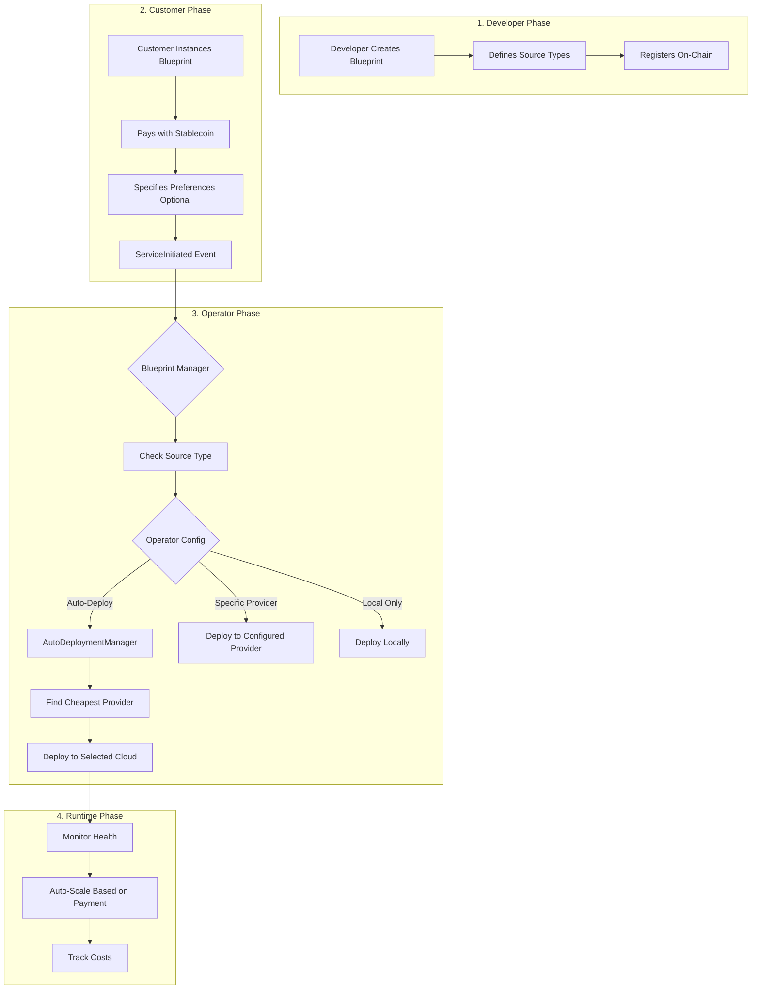

# Blueprint Remote Providers Architecture

## Overview

The `blueprint-remote-providers` crate extends the Blueprint SDK with cloud deployment capabilities, enabling operators to deploy blueprint instances across multiple cloud providers and Kubernetes clusters. This system maintains a clear separation between what developers define (blueprint sources) and how operators deploy them (runtime decisions).

## Core Concepts

### Blueprint Sources (Developer-Defined)

Developers specify deployment sources when registering blueprints on-chain:

```rust
enum BlueprintSource {
    Native(NativeFetcher),     // Binary executables (GitHub releases, IPFS)
    Container(ImageRegistry),  // Docker/OCI containers
    Wasm { ... },             // WebAssembly (future)
    Testing(TestFetcher),     // Development/testing
}
```

### Deployment Targets (Operator-Controlled)

Operators choose HOW and WHERE to run blueprint instances:

```rust
enum DeploymentType {
    // Local deployments
    LocalDocker,           // Docker daemon
    LocalKubernetes,       // Local K8s with Kata containers
    LocalHypervisor,       // Cloud Hypervisor VMs
    
    // Cloud VMs
    AwsEc2,               // AWS EC2 instances
    GcpGce,               // Google Compute Engine
    AzureVm,              // Azure Virtual Machines
    DigitalOceanDroplet,  // DigitalOcean Droplets
    VultrInstance,        // Vultr Cloud Compute
    
    // Kubernetes clusters
    AwsEks,               // AWS Elastic Kubernetes Service
    GcpGke,               // Google Kubernetes Engine
    AzureAks,             // Azure Kubernetes Service
    DigitalOceanDoks,     // DigitalOcean Kubernetes
    VultrVke,             // Vultr Kubernetes Engine
    
    // Other
    SshRemote,            // SSH deployment to bare metal
    BareMetal,            // Direct bare metal execution
}
```

## Architecture Flow



## Key Components

### 1. AutoDeploymentManager

Automatically deploys services to the most cost-effective provider:

```rust
pub struct AutoDeploymentManager {
    provisioner: Arc<UnifiedProvisioner>,
    pricing_service: Arc<PricingService>,
    deployment_tracker: Arc<DeploymentTracker>,
}

impl AutoDeploymentManager {
    pub async fn auto_deploy_service(
        &self,
        blueprint_id: u64,
        service_id: u64,
        spec: ResourceSpec,
        ttl_seconds: Option<u64>,
    ) -> Result<RemoteDeploymentConfig> {
        // 1. Get real-time pricing from all providers
        // 2. Select cheapest that meets requirements
        // 3. Provision infrastructure
        // 4. Deploy service
        // 5. Track deployment
    }
}
```

### 2. RemoteClusterManager

Manages multiple Kubernetes clusters across providers:

```rust
pub struct RemoteClusterManager {
    clusters: Arc<RwLock<HashMap<String, RemoteCluster>>>,
    active_cluster: Arc<RwLock<Option<String>>>,
}

pub struct RemoteDeploymentConfig {
    pub kubeconfig_path: Option<PathBuf>,
    pub context: Option<String>,
    pub namespace: String,
    pub provider: CloudProvider,
    pub region: Option<String>,
}
```

### 3. PricingService

Fetches real-time pricing without API keys using public sources:

```rust
pub struct PricingService {
    vantage_client: VantageAggregator,      // AWS & Azure
    gcp_pricing: GcpPublicPricing,          // GCP Calculator
    do_pricing: DigitalOceanPublicPricing,  // HTML scraping
    vultr_pricing: VultrPublicPricing,      // Hardcoded rates
}
```

### 4. DeploymentTracker

Tracks all active deployments with cleanup handlers:

```rust
pub struct DeploymentTracker {
    deployments: Arc<RwLock<HashMap<String, DeploymentRecord>>>,
    cleanup_handlers: Arc<RwLock<HashMap<DeploymentType, Box<dyn CleanupHandler>>>>,
}

pub struct DeploymentRecord {
    pub deployment_id: String,
    pub blueprint_id: u64,
    pub service_id: u64,
    pub deployment_type: DeploymentType,
    pub provider: CloudProvider,
    pub resource_ids: HashMap<String, String>,
    pub created_at: DateTime<Utc>,
    pub ttl: Option<Duration>,
}
```

## Decision Hierarchy

The system respects a three-tier decision hierarchy:

### 1. Blueprint Requirements (Hard Constraints)
Developer-defined requirements that cannot be violated:
- Minimum CPU/memory/storage
- GPU requirements
- Network requirements

### 2. Customer Preferences (Payment-Based)
Customer choices based on payment tier:
- Deployment region
- High availability
- Performance tier
- Multi-region deployment

### 3. Operator Defaults (Fallback)
Operator configuration when no preferences specified:
- Preferred providers
- Cost optimization settings
- Default regions

## Payment-Driven Scaling

The system automatically adjusts resources based on payment:

```rust
pub enum PaymentTier {
    Basic => {
        replicas: 1,
        cpu: "100m",
        memory: "128Mi",
        autoscale: false,
    },
    Standard => {
        replicas: 2,
        cpu: "500m",
        memory: "512Mi",
        autoscale: true,
        max_replicas: 5,
    },
    Premium => {
        replicas: 3,
        cpu: "2000m",
        memory: "4Gi",
        autoscale: true,
        max_replicas: 20,
        gpu: Some(1),
    },
}
```

## Kubernetes Deployment

When deploying to Kubernetes, the system:

1. **Packages the blueprint** as a container if not already
2. **Creates K8s resources** (Deployment, Service, HPA)
3. **Configures auto-scaling** based on payment tier
4. **Sets resource limits** according to specifications
5. **Monitors health** and adjusts as needed

### Supported K8s Features

- **Multi-cluster management** via kubeconfig files
- **Namespace isolation** for multi-tenancy
- **Horizontal Pod Autoscaling** (HPA)
- **GPU support** for ML/AI workloads
- **StatefulSets** for persistent storage
- **Service mesh** integration (future)

## Public Pricing Sources

The system fetches pricing data without API keys:

| Provider | Source | Method |
|----------|--------|--------|
| AWS | Vantage.sh, EC2Instances.info | JSON API |
| Azure | prices.azure.com, Vantage.sh | JSON API |
| GCP | Cloud Pricing Calculator | JSON API |
| DigitalOcean | Pricing page | HTML scraping |
| Vultr | Documentation | Hardcoded |

## Blueprint Manager Integration

The remote providers integrate seamlessly with Blueprint Manager:

```rust
// In Blueprint Manager's event handler
impl RemoteEventHandler {
    pub async fn on_service_initiated(
        &self,
        blueprint_id: u64,
        service_id: u64,
        resource_requirements: Option<ResourceSpec>,
    ) -> Result<()> {
        if self.config.auto_deploy_enabled {
            let deployment = self.auto_deployment
                .auto_deploy_service(blueprint_id, service_id, spec, ttl)
                .await?;
            
            info!("Auto-deployed to {}: {}", 
                deployment.provider, deployment.deployment_id);
        }
        Ok(())
    }
}
```

## Testing Strategy

### Local K8s Testing

For E2E testing without cloud providers:

```bash
# Option 1: k3d (recommended)
k3d cluster create test-cluster
export KUBECONFIG=$(k3d kubeconfig get test-cluster)

# Option 2: kind
kind create cluster --name test
export KUBECONFIG=$(kind get kubeconfig --name test)

# Option 3: minikube
minikube start
export KUBECONFIG=$(minikube kubectl -- config view)
```

### Test Helpers

```rust
// Create test manager with mock clusters
let manager = TestHelper::create_test_manager().await;

// Test deployment without real infrastructure
let config = RemoteDeploymentConfig {
    kubeconfig_path: Some("~/.kube/test-config".into()),
    namespace: "test",
    provider: CloudProvider::Generic,
    ..Default::default()
};
```

## Example Deployment Flow

### 1. Developer Phase
```rust
// Developer registers blueprint with container source
BlueprintSource::Container(ImageRegistryFetcher {
    registry: "docker.io",
    image: "myorg/ai-agent:v1.0.0",
})
```

### 2. Customer Phase
```rust
// Customer instances with preferences
instance_blueprint(
    blueprint_id: 123,
    payment: 100_USDC,
    preferences: {
        region: "us-east-1",
        high_availability: true,
    }
)
```

### 3. Operator Phase
```rust
// Operator config determines deployment
match operator_config.deployment_mode {
    DeploymentMode::AutoCheapest => {
        // Finds AWS Spot at $0.02/hour
        deploy_to_aws_eks_spot(blueprint, instance)
    },
    DeploymentMode::PreferredProvider(provider) => {
        deploy_to_provider(provider, blueprint, instance)
    },
    DeploymentMode::Local => {
        deploy_to_local_k8s_with_kata(blueprint, instance)
    }
}
```

### 4. Runtime Phase
```rust
// System monitors and scales
loop {
    let metrics = monitor_deployment(deployment_id).await;
    
    if metrics.cpu_usage > 70% && payment_allows_scaling {
        scale_up_deployment(deployment_id).await;
    }
    
    if payment_expired {
        scale_to_zero(deployment_id).await;
    }
    
    sleep(Duration::from_secs(30)).await;
}
```

## Security Considerations

- **Sandboxing**: Local K8s uses Kata containers for isolation
- **Network isolation**: Each deployment gets isolated networking
- **Resource limits**: Enforced at container/VM level
- **Secret management**: Integration with cloud KMS services
- **RBAC**: Kubernetes role-based access control

## Future Enhancements

- [ ] Service mesh integration (Istio/Linkerd)
- [ ] Multi-region failover
- [ ] Cost prediction models
- [ ] SLA-based deployment decisions
- [ ] Spot instance bidding strategies
- [ ] Edge deployment support
- [ ] WASM runtime integration

## Configuration Example

```toml
[operator.deployment]
mode = "auto-cheapest"
preferred_providers = ["aws", "gcp"]
max_cost_per_hour = 1.0
allow_spot_instances = true

[operator.kubernetes]
clusters = [
    { name = "aws-prod", kubeconfig = "/etc/k8s/aws.config" },
    { name = "gcp-staging", kubeconfig = "/etc/k8s/gcp.config" },
]

[operator.scaling]
enabled = true
min_replicas = 1
max_replicas = 10
target_cpu = 70
```

## Summary

The Blueprint Remote Providers system enables:
- **Developers** to focus on building blueprints without cloud complexity
- **Operators** to optimize costs and manage infrastructure efficiently  
- **Customers** to get reliable service deployment based on payment
- **The network** to scale dynamically across multiple cloud providers

The architecture maintains clear separation of concerns while providing maximum flexibility for deployment strategies.