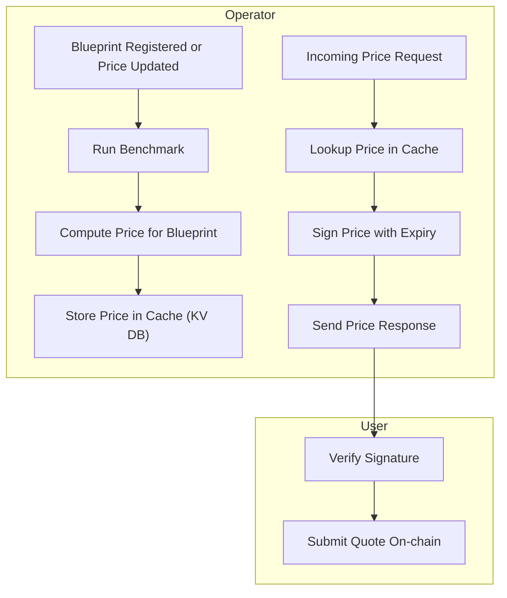

# Operator RFQ Pricing Server

This system defines a simplified decentralized pricing mechanism in which each **operator** runs a **local RPC server** to respond to **user price requests**. Prices are generated based on **benchmarking configurations** for specific blueprints and cached in a local **key-value store**. When a user requests a quote, the operator returns a **signed price quote** that includes an **expiry block number** or **timestamp** for on-chain verification.

---

## 🔄 System Flow Diagram



---

## 🔧 Technologies Used

-   **Rust** (Operator server and benchmarking engine)
-   **Tonic** (gRPC server)
-   **SQLite / RocksDB / Sled** (for local price cache)
-   **ed25519 / secp256k1** (signature scheme)
-   **SHA256** (message hashing)
-   **Web3 library** (optional: for on-chain verification testing)

---

## 📁 File Structure

```
operator_rfq/
├── Cargo.toml
├── src/
│   ├── main.rs         # RPC server + request handler
│   ├── benchmark.rs    # Benchmarking logic per blueprint
│   ├── pricing.rs      # Price computation engine
│   ├── cache.rs        # Local DB wrapper (RocksDB or SQLite)
│   ├── signer.rs       # Signature generation + verification
│   └── proto/          # gRPC proto definitions
└── README.md           # This file
```

---

## ✍️ Example Flow

### Blueprint Registration or Price Update:

1. Operator receives new blueprint registration.
2. Runs a benchmark (e.g. CPU time, memory, disk I/O).
3. Calculates pricing model (e.g. linear or exponential curve).
4. Stores result in local database: `price_cache[blueprint_hash] = PriceModel { price_per_unit, timestamp }`

### User Request:

1. User sends a `GetPrice(blueprint_hash)` RPC request.
2. Operator fetches cached price.
3. Signs the quote with:
    - Price amount
    - Blueprint hash
    - Timestamp or block number
4. Sends back `SignedQuote { price, blueprint_hash, timestamp, signature }`

### On-Chain Verification:

1. Smart contract checks:
    - Signature is valid.
    - Block number is within expiry.
    - The quoted blueprint matches user job.

---

## ⚡ Quote Signature Format

```rust
struct QuotePayload {
    blueprint_hash: [u8; 32],
    price_wei: u128,
    timestamp_or_block: u64,
}
```

Hash with `sha256`, sign with `ed25519`:

```rust
let msg = sha256(encode(&QuotePayload));
let sig = keypair.sign(&msg);
```

---

## 🚀 Quick Start

```bash
# Build the server
cargo build --release

# Run the gRPC server
cargo run --bin operator_rfq
```

---

## ✅ Future Extensions

-   Add support for **multi-resource pricing** (CPU + RAM + storage).
-   Implement **on-chain validation smart contract**.
-   Add **gossip/pubsub** for broadcasting available blueprints.
-   Add **reputation system** to weigh operator reliability.

---

## 📅 License

MIT or Apache 2.0
