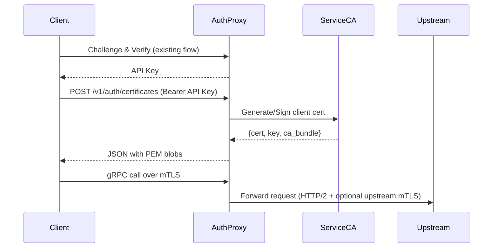

# Auth Proxy mTLS Support Plan

## Context
- `AuthenticatedProxy` currently terminates only clear-text HTTP/1.1 and HTTP/2; TLS/mTLS handshakes never reach user code (`crates/auth/src/proxy.rs`).
- Upstream services rely on the proxy for authentication (challenge → API key → Paseto token) and receive tenant metadata via injected headers.
- We must add TLS termination while preserving support for non-TLS (e.g., Caddy in front of HTTP) and introduce end-to-end mTLS delegation so upstreams offload certificate handling to the proxy.

## Goals
- Accept both clear-text and TLS connections, with mTLS required per service policy.
- Terminate client-side mTLS inside the proxy, extract client identity, and continue to inject tenant headers.
- Optionally perform TLS/mTLS when proxying upstream, reusing service-scoped credentials.
- Store CA material, issued cert metadata, and private keys encrypted in RocksDB using an envelope key sourced like the Paseto signing key (env var or filesystem path).
- Provide an authenticated API for issuing short-lived client certificates backed by a service-specific CA.

## Design Overview
### TLS Profile Administration API
- Endpoint: `PUT /v1/admin/services/{service_id}/tls-profile` (authenticated via operator token or internal control plane).
- Request fields:
  - `require_client_mtls` – whether the proxy should block plaintext connections for this service.
  - `client_cert_ttl_hours` – max lifetime permitted for issued client certificates.
  - `subject_alt_name_template` – optional format string for embedding tenant IDs in SANs.
  - `allowed_dns_names` / `allowed_uris` – optional allowlists enforced during issuance.
- Response returns the active profile, including:
  - `mtls_listener` – URI clients must target for mutual TLS.
  - `http_listener` – legacy h2c endpoint (if enabled).
  - `ca_certificate_pem` – bootstrap CA bundle clients need before requesting certificates.
- Enabling the profile spins up/reloads the TLS listener with a per-service `ServerConfig`, persisting encrypted assets in RocksDB.

### Inbound Transport
- Run dual listeners:
  - Existing clear-text listener (HTTP/1.1 & h2c) for legacy HTTP clients and for TLS terminated by Caddy.
  - New TLS listener using `tokio_rustls::TlsAcceptor` with ALPN `h2`/`http/1.1`. Use `rustls::server::Acceptor` to select a `ServerConfig` per service/SNI before handshake completes. 
- Each `ServerConfig` holds:
  - Server cert/key issued by the service CA (or a shared default CA if none configured).
  - `ClientCertVerifier` built from the trusted client CA bundle. Require client auth when policy says so; optionally allow unauthenticated TLS for HTTPS-only services. citeturn2open0turn1open1
- After handshake, attach the peer certificate chain to request extensions so existing middleware can read it before `extract_and_validate_auth` runs.

### Outbound Transport
- Replace `HttpConnector` with a shared `hyper_rustls::HttpsConnector` configured via `HttpsConnectorBuilder::new().with_native_roots().https_or_http().enable_http2()` for dual-mode HTTP/TLS upstream calls.
- When a service marks `upstream_tls.required=true`, the proxy loads its upstream CA bundle and client cert/key (if mTLS) from encrypted storage, builds a per-service `rustls::ClientConfig`, and inserts it into the connector via `tower::ServiceBuilder` layer.
- Maintain connection pools keyed by service ID + TLS policy to avoid cross-service credential reuse.

### Identity & Header Propagation
- Validate client cert subject against service policy (e.g., allowlist SANs or OIDs). Map the resulting identity to tenant metadata and inject via existing header enrichment path (`apply_additional_headers`).
- Continue supporting bearer API keys / Paseto tokens for clients that skip mTLS; services can opt-in to require both (defense in depth).

## Secret Management
- Introduce `TLS_ENVELOPE_KEY` (hex) or `TLS_ENVELOPE_KEY_PATH` similar to `PASETO_SIGNING_KEY`. On startup, load 32 bytes, or generate and persist with `0o600` permissions if absent.
- Use that symmetric key for envelope encryption of secret material stored in RocksDB: wrap private keys and CA secrets with XChaCha20-Poly1305 (reuse `PasetoKey` helper).
- Keep ciphertext + nonce in the DB; decrypt only in memory. Zeroize buffers after use.
- Log and metric secret rotations; add CLI/admin command to rotate the envelope key that re-encrypts stored material.

## Data Model Updates
- Extend `ServiceModel` protobuf with a `TlsProfile` message:
  - `bool tls_enabled`
  - `bool require_client_mtls`
  - `bytes encrypted_server_cert`, `bytes encrypted_server_key`
  - `bytes encrypted_client_ca_bundle`
  - `bytes encrypted_upstream_ca_bundle`
  - `bytes encrypted_upstream_client_cert`, `bytes encrypted_upstream_client_key`
  - `uint32 client_cert_ttl_hours`
  - `optional string sni`
- Add `ServiceCertMetadata` CF keyed by `(service_id, cert_id)` storing PEM, serial, expiration, revocation flag, issuance audit info.
- Record issuance operations in an append-only log (existing RocksDB CF) to enable auditing and later revocation workflows.

## Certificate Issuance API
- Endpoint: `POST /v1/auth/certificates` (requires `Authorization: Bearer <API key>`). Request body:
  ```json
  {
    "service_id": "123:0",
    "common_name": "tenant123",
    "subject_alt_names": ["spiffe://tenant123/service"],
    "usage": ["client"],
    "ttl_hours": 24
  }
  ```
- Flow:
  1. Authenticate API key via existing path; ensure caller belongs to the service and that `TlsProfile.require_client_mtls` is true.
  2. Load (or lazily create) the service CA pair. If absent, generate with `rcgen`, encrypt, persist, and self-sign; publish CA cert to clients. citeturn1open3turn1open2
  3. Generate ephemeral client keypair (`rcgen::KeyPair`), build CSR, sign with service CA, embed policy OIDs (tenant ID, scopes).
  4. Encrypt and store client private key + metadata; return JSON with PEM strings:
     ```json
     {
       "certificate_pem": "...",
       "private_key_pem": "...",
       "ca_bundle_pem": "...",
       "expires_at": "2025-09-19T12:00:00Z",
       "serial": "abc123",
       "revocation_url": "/v1/auth/certificates/abc123/revoke"
     }
     ```
  5. Optionally offer downloadable PKCS#12 for platforms needing it (base64 in JSON).
- Enforce TTL bounds from `client_cert_ttl_hours`. Deny issuance if service policy forbids new certs or envelope key missing.

## Operational Considerations
- Provide admin APIs for:
  - Listing and revoking issued certs (mark revoked, publish CRL or stapled revocation header).
  - Rotating service CA (issue new CA, migrate clients, update server certs on listeners).
- Emit metrics/logs for handshake successes/failures, issuance events, and revocations.
- Update integration tests: spin up rustls-backed gRPC server requiring mTLS; issue cert via new endpoint; exercise request flow end-to-end.

## Test Plan (Red Stage)
- `admin_can_enable_service_mtls_and_issue_certificates` (`crates/auth/src/tests/mtls_flow_tests.rs:166`): verifies the admin endpoint enables mTLS and that certificate issuance responds with PEM assets and a revocation URL.
- `certificate_ttl_longer_than_policy_is_rejected` (`crates/auth/src/tests/mtls_flow_tests.rs:214`): expects the issuance API to enforce max TTL policies and reject oversized requests with `400 Bad Request`.
- `plaintext_grpc_requests_are_rejected_when_mtls_required` (`crates/auth/src/tests/mtls_flow_tests.rs:245`): describes required behaviour where plaintext gRPC calls are denied with `Code::Unauthenticated` once mTLS is mandatory.
- `grpc_request_with_signed_certificate_succeeds` (`crates/auth/src/tests/mtls_flow_tests.rs:278`): demonstrates the happy path where a freshly issued client cert enables a mutual TLS gRPC round trip.

## Implementation Steps
1. Add envelope key loader module (mirroring Paseto key init) and introduce encryption helpers.
2. Extend `ServiceModel` protobuf + migrations; create new CFs for TLS assets and cert metadata.
3. Implement TLS listener (dual sockets) and request extension plumbing for client cert identity.
4. Swap outbound connectors for `hyper_rustls` with per-service TLS configs; add caching layer.
5. Build certificate authority utilities (rcgen-based) and encrypted storage wrappers.
6. Implement `/v1/auth/certificates` issuance endpoint + validation + auditing.
7. Wire mTLS identity to existing header injection and authorization paths.
8. Make the red-stage mTLS tests green, then expand coverage for admin flows, metrics, and documentation updates.

## Mermaid Diagram


## References
1. Rustls server config selection via `Acceptor` – rustls documentation. citeturn2open0
2. Cloudflare API Shield mTLS practices (dedicated CA per customer). citeturn1open1
3. hyper-rustls dual HTTP/HTTPS connector builder. citeturn1open0
4. rcgen certificate generation library usage. citeturn1open3
5. Tyk API Gateway: issuing client certificates over API. citeturn1open2
6. Azure guidance on encrypting secrets with envelope keys. citeturn1open4
```
